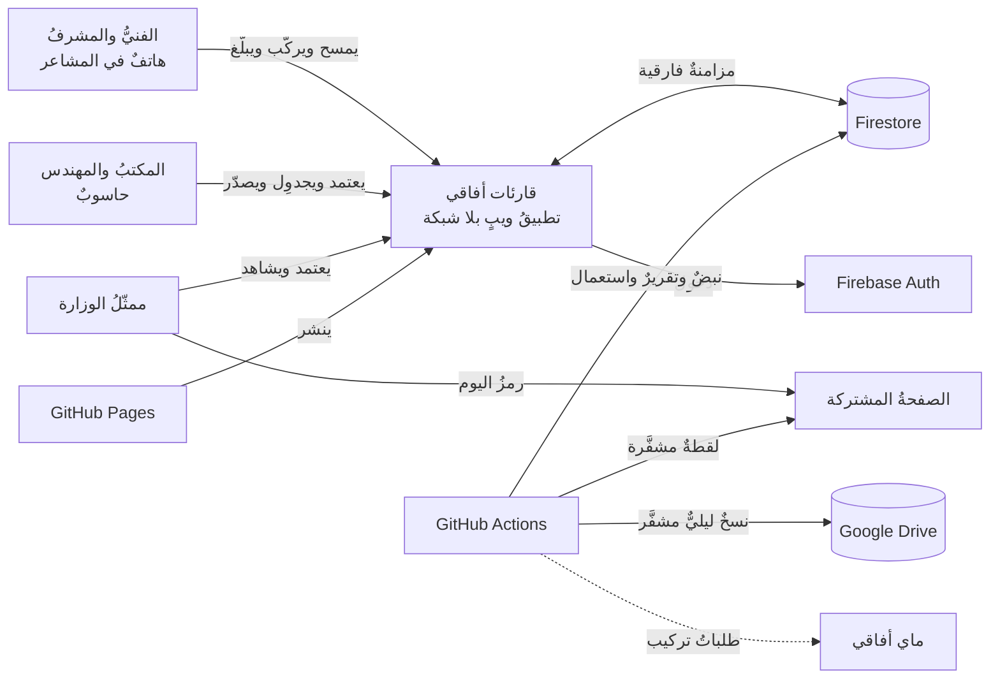
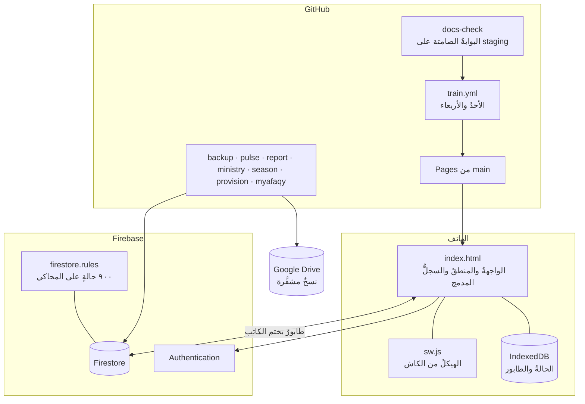

# المعماريةُ في صفحة — قارئات أفاقي (V18.0)

> هذه الصفحةُ تحلُّ محلَّ `docs/nusuk-tech-spec.docx` (V13.21 — مُلغاة). التفصيلُ في `docs/system.md`.

## ١ · الفكرةُ الحاكمة
ملفٌّ واحدٌ (٨٩١ كيلوبايت مضغوطًا) يعمل بلا شبكة على هاتف الفنيّ، وقاعدةٌ واحدةٌ تُزامَن حين تعود الشبكة، ولا خادمَ خاصًّا: الأتمتةُ كلُّها في GitHub Actions. كلُّ رقمٍ يُعرَض له تعريفٌ واحدٌ في الشيفرة (`lifeOf` · `siteKeyStats`) تحرسه الجرود.

## ٢ · المكوّنات
| المكوّن | أين | ما يفعل | من يقرؤه |
|---|---|---|---|
| **التطبيق** `index.html` | GitHub Pages (`main`) | الواجهةُ والمنطقُ وسجلُّ المواقع المدمج وقاموسا الترجمة | كلُّ الأدوار من الهاتف والمكتب |
| **عاملُ الخدمة** `sw.js` | الهاتف | الهيكلُ من كاش النسخة أوّلًا؛ `sw.js` شبكةٌ فقط فيُرى الجديد؛ `docs/` شبكةٌ أوّلًا | المتصفّح |
| **المخزنُ المحلي** IndexedDB | الهاتف | الحالةُ كاملةً والطابورُ؛ لا يستسلم عند البطء أو الخطأ (إعادةٌ بتراجع، لافتةٌ حمراء) | التطبيق |
| **Firestore** | Firebase (Spark) | الوثائقُ بمجموعاتها (§٦ في system.md)؛ سحبٌ فارقيٌّ بنبضة `settings/pulse`؛ القواعدُ `firestore.rules` | التطبيق بدوره؛ السيورُ بحساب الخدمة |
| **Authentication** | Firebase | بريد/كلمة مرور؛ الحساباتُ تُنشَأ من سير `provision` أو ذاتيًّا غيرَ فعّالة | التطبيق |
| **البوابةُ الصامتة** `docs-check.yml` | Actions على `staging` | القائمةُ نفسُها التي يشغّلها الحارسُ محلّيًّا في أربع شرائح + المتصفّحُ الحقيقيُّ + محاكي القواعد؛ الترقيةُ إلى `main` حين تخضرُّ الستُّ بواباتٍ — والفشلُ تعليقٌ على الالتزام لا تشغيلٌ أحمر | المساعدُ البرمجي |
| **النسخُ الليلي** `backup.yml` | Actions | تشفيرٌ ← رفعٌ مشفَّرٌ إلى Google Drive ← بروفةُ استعادة؛ في المستودع الأعدادُ فقط | صاحبُ المشروع (الدرايف) |
| **النبضُ والتقرير** `pulse.yml` · `report.yml` | Actions | ما ينتظر قرارًا، الجاهزيةُ، الاستعمالُ، قراءاتُ اليوم → `settings/sysreport` · `settings/usage` (+ بريدٌ حين يلزم) | المكتبُ في صحة النظام |
| **شاشةُ الوزارة** `ministry.yml` | Actions → فرع `ministry` + `docs/ministry/` | لقطةٌ مشفَّرةٌ كلَّ ٦ ساعات؛ PDF كلَّ سبت | ممثّلُ الوزارة برمز اليوم |
| **الجسور** `myafaqy.yml` · `season.yml` · `provision.yml` | Actions | ماي أفاقي (خاملٌ حتى يُضبَط) · تغذيةُ الموسم والتوائم · إنشاءُ الحسابات وإغلاقُ البلاغات القديمة | القاعدة |

## ٣ · مسارُ الطلب — ثلاث لحظات
1. **الميدانُ بلا شبكة**: النموذجُ يُحفَظ في IndexedDB ويدخل الطابورَ؛ الصورُ في طابورٍ آخر. لا شيءَ يضيع ولو أُغلق التطبيق — وإن تعطّل الحفظُ المحليُّ ظهرت لافتةٌ لا تُغلَق.
2. **عودةُ الشبكة**: الطابورُ يُرفَع بختم الكاتب (`_by`)؛ ما ترفضه القواعدُ يُعزَل برفض صلاحيةٍ ويعود وحدَه حين يزول السبب (تفعيلُ الحساب).
3. **المكتبُ**: يسحب ما تغيّر فقط (نبضةُ التغيير)، ويرى الرقمَ الواحدَ في كلِّ شاشة، ويصدّر المحاضرَ والتقارير.

## ٤ · حدودُ الثقة
- المستودعُ عامٌّ: لا سرَّ ولا بيانةَ خامًا فيه — الأسرارُ في GitHub Secrets، والنسخُ مشفَّرٌ، واللقطةُ مشفَّرة.
- القواعدُ هي الحارسُ الأخير: ٩٠٠ حالةٍ على المحاكي، منها طقمُ ثلاث شخصياتٍ معاديةٍ على كلِّ مجموعة — ومجموعةٌ بلا توقّعٍ تُسقط الحارس.
- الجهازُ الذي يشغّل الحارسَ نسخةٌ من السحابة (جردُ تطابق البيئة) — فلا ينجح محلّيًّا ما سيسقط هناك.

## ٥ · ما يُقاس
قراءاتُ اليوم على حصة ٥٠ ألفًا (كهرمانيٌّ عند ٧٠٪) · وتيرةُ المسح وتوقّعُ اكتماله لكلِّ مشعر · الزمنُ بين مراحل التركيب التجريبي · حضورُ الأجهزة ونسخُها.

## ٦ · مخطّطُ السياق

## ٧ · مخطّطُ الحاويات

